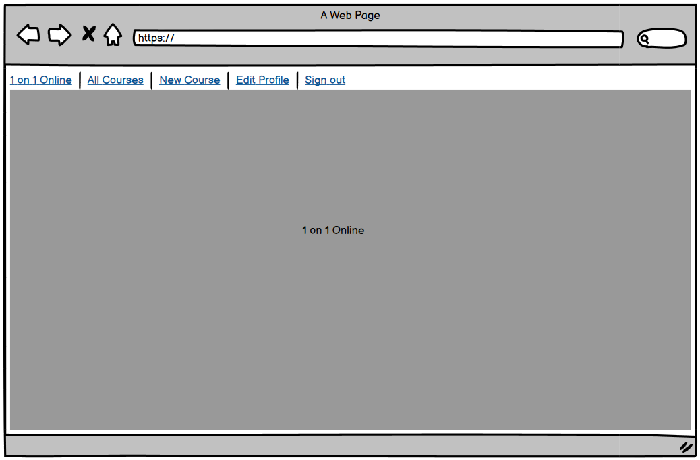
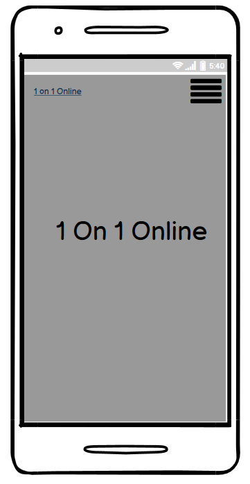
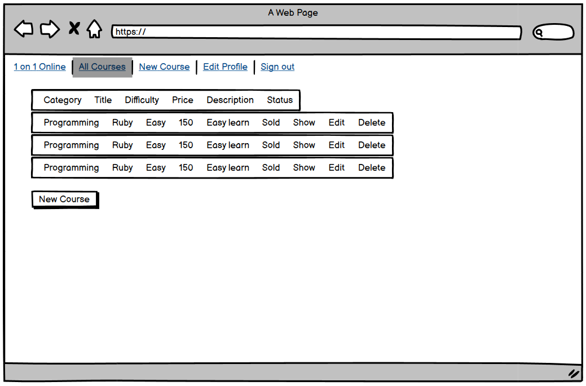
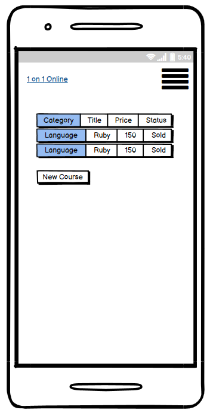
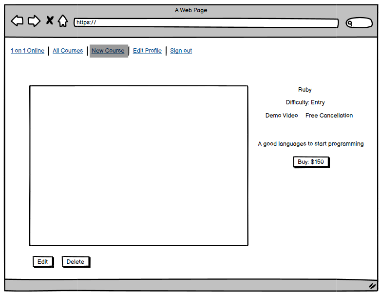
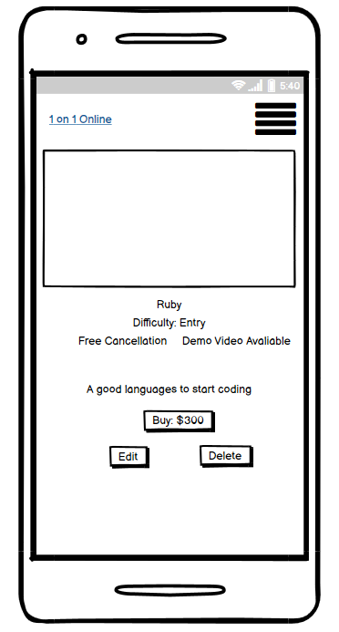
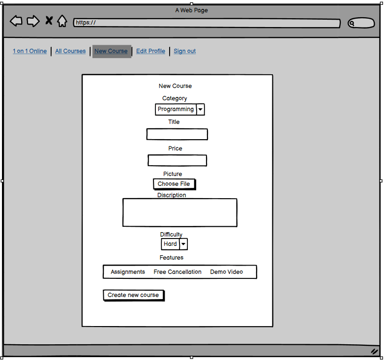
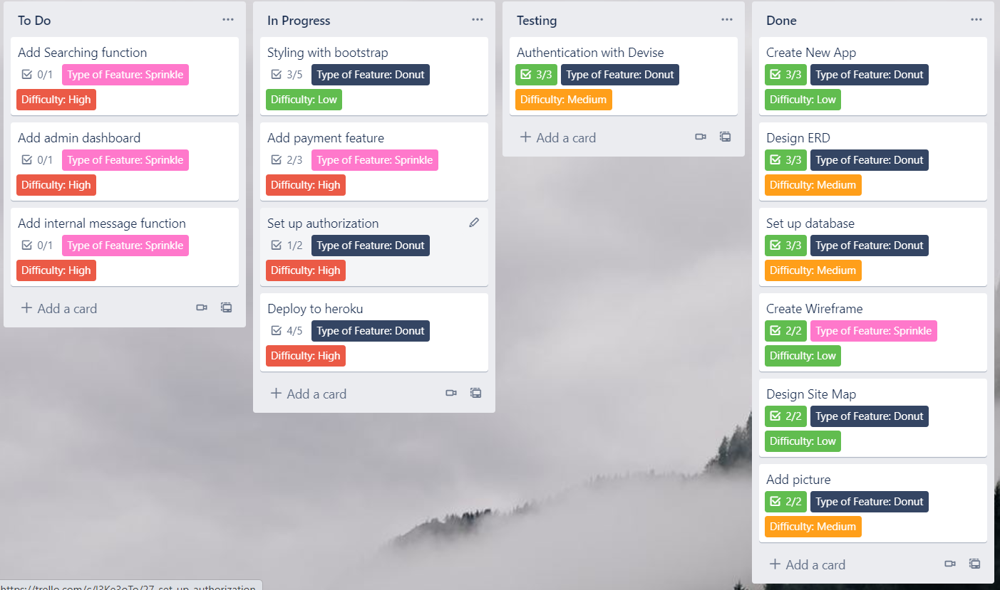

# README
## Q7 Problem trying to solve
Nowadays, more and more people want to learn something in their leisure time, but their schedule is not fixed, so go to classes on campus would make them give up on this and lay on the bed doing nothing. So online-course will give everyone opportunities to study without going to campus and waste lots of traveling time, also, one-on-one teach will solve the problem of their limited time schedule since the class time will be much more flexible than a big class.
## Q8 Reason
Because of the Covid-19, people spend more time at home doing nothing, more people would feel guilty when they waste lots of time at home. However, there is no better time to learn. In this case, an online course will be a good solution to this situation and the one-on-one teaching mode will give everybody more flexibility, they can decide what time they want to study and this will make them more motivited, less stressed.
## Q9 Deployed app URL
https://ray-project.herokuapp.com/
## Q10 Github repository
https://github.com/RuilaiZhang/New_app
## Q11 description
- Purpose
- Functionality
- Sitemap
- Screenshots
- Target audience
- Tech Stack

## Q12 User stories

## Q13 Wireframes
### Home:

### List:

### Show:

### Create

## Q14 ERD

## Q15 High-level components

## Q16 Third party services

## Q17 Model relationship (active record associations)

## Q18 Database relations

## Q19 Database schema design

## Q20 Tasks allocated and tracked
### I use trello board to record tasks and track them, here is the screenshot of my trello board.

