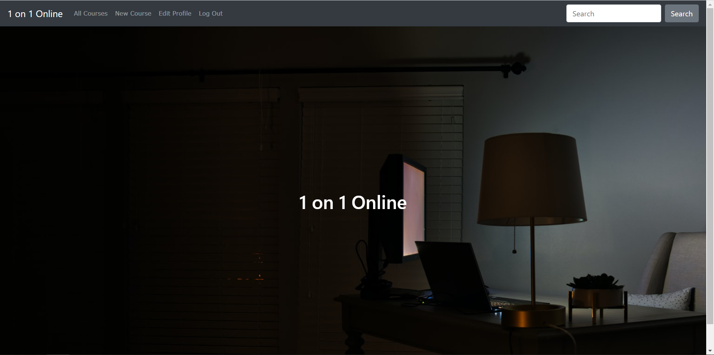

# README
## Q7 Problem trying to solve
Nowadays, more and more people want to learn something in their leisure time, but their schedule is not fixed, so go to classes on campus would make them give up on this and lay on the bed doing nothing. So online-course will give everyone opportunities to study without going to campus and waste lots of traveling time, also, one-on-one teach will solve the problem of their limited time schedule since the class time will be much more flexible than a big class.
## Q8 Reason
Because of the Covid-19, people spend more time at home doing nothing, more people would feel guilty when they waste lots of time at home. However, there is no better time to learn. In this case, an online course will be a good solution to this situation and the one-on-one teaching mode will give everybody more flexibility, they can decide what time they want to study and this will make them more motivited, less stressed.
## Q9 Deployed app URL
https://ray-project.herokuapp.com/
## Q10 Github repository
https://github.com/RuilaiZhang/New_app
## Q11 description
- Purpose

Solving the problem that people who stay at home have nothing to do during the pandemic period. However, their time schedule can not support them to attend a proper class. Also，some people only want to learn some basics in some area for interests, spend lots of money to learn the whole procedure to be a professional is not what they really need. In this case, an online 1 on 1 course will solve their needs perfectly. On the other hand, you also can be a teacher when you are free if you are talented in some area, you can share your skill with someone else and earn some money in the mean time.
- Features

As an educator, you can create any course in different areas, the course can belong to any category to suits different needs. You can add a difficulty level and special features for your course and give it a price of course. In addition, you can upload a picture and write a brief description for your course to attract students. After you publish it, you still can edit it as the owner. As a student, you can view any courses listed and buy courses that are still available by card. Both types of uses will have their own account, and they are only permitted to do authorized operations.
- Sitemap

- Screenshots

- Target audience

The target audiences for this app would be people who have tons of time that they have to stay at home and they whether want to earn many in their leisure time or they want to learn something interesting. Both of them will be attracted by this teaching one-on-one teaching mode.
- Tech Stack

Ruby，Rails，PostgreSQL, Bootstrap, Strip, HTML, CSS, javascript, rspec, Jason, Yarn, ultrahook, AWS
## Q12 User stories
As the full stack web developer of this app, I am in charge of adding new features and debugging and styling with one person. In this case, on the better side, it's easy for me to cooperate with myself without conflict, on the other side, the productivity and efficiency may be good as a whole development team. As the only developer, I have developed the database, authentication, authorized different users, some association, payment method, and styling of course. In the feature, I would like to add internal message features which is makes communicating between users become much easier. Also, I would like to add some security features to protect users' information since the database may get larger when more users come, protecting customers' personal information will become one of the most important issues.
## Q13 Wireframes
### Home:

### List:

### Show:

### Create:

## Q14 ERD

## Q15 High-level components
Basically, I used the model view controller framework to build this app. For the model part, I created several models includes listing, feature, listing feature, user, order, and category which basically covers everything I need to describe the relationships between data in my database. In order to let users actually see the website, some views pages are created that include the main layout, listings, payment, and some shared pages such as navbar and flash notice. Last but not the list, I also need some controllers to be the interface between my models and views to process logic and requests which include listings_controller, application_controller, and payments_controller.
## Q16 Third party services

## Q17 Model relationship (active record associations)

## Q18 Database relations

## Q19 Database schema design
Because the time I have to develop this application is very limited, lots of information and content that I planed in ER diagram are not in my real database scheme design. Most of the changes are about the clients, I deleted that part and only focus on the educator and students which are sellers and buyers which is good enough for me at this moment. It still can solve the problem and have big market, especially during pandemics.

## Q20 Tasks allocated and tracked
### I use trello board to record tasks and track them, here is the screenshot of my trello board.

